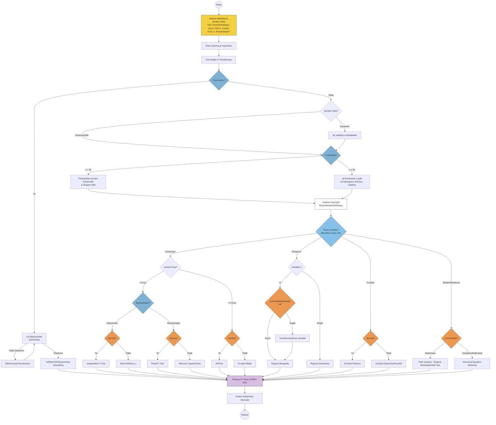

# Spesifikasi Pengembangan: Sistem Analisis Data Statistik Otomatis

**Versi:** 1.1 (Revisi — disinkronkan dengan diagram alur & PRD v2.0)

## 1. Ringkasan

Dokumen ini menjelaskan spesifikasi teknis untuk sistem yang secara otomatis mendeteksi struktur data input, memilih jalur pemrosesan statistik yang sesuai, menjalankan uji asumsi dan uji hipotesis, lalu menghasilkan interpretasi hasil secara otomatis.

Sistem dirancang generik — dapat menangani berbagai bentuk data (cross-sectional maupun time series, data primer kuesioner maupun data sekunder/observasi/database) dan berbagai tujuan analisis (komparasi, pengaruh, korelasi, mediasi/moderasi).

---

## 2. Diagram Alur Utama



> **Catatan revisi**: node `StatDesk` (Analisis Deskriptif) kini digambar eksplisit sebagai perhentian wajib sebelum node `Goal`, agar diagram dan teks penjelasan konsisten. Ambang n dituliskan eksplisit (`n < 30` / `n ≥ 30`) mengikuti keputusan pada §3.6.

---

## 3. Modul & Tahapan Pemrosesan

### 3.1 Deteksi Metadata & Struktur Data
Input mentah diperiksa untuk mengekstrak:
- **Tipe variabel**: numerik (kontinu/diskrit) atau kategorikal (nominal/ordinal)
- **Struktur waktu**: cross-sectional (CS) atau time series (TS)
- **Jumlah grup**: relevan untuk analisis komparasi
- **Ukuran sampel (n)**: memengaruhi pemilihan uji normalitas dan kelayakan uji parametrik
- **Struktur pasangan**: apakah observasi antar grup saling berpasangan (misal pre-post, atau dua sumber data pada objek yang sama) atau independen
- **Tujuan analisis**: diambil dari **input eksplisit pengguna** saat request analisis dikirim (lihat §3.8 dan keputusan §4.4)

**Output**: objek metadata yang menjadi acuan seluruh decision node berikutnya.

### 3.2 Data Cleaning & Imputation
- Deteksi dan penanganan missing values (deletion, mean/median imputation, atau model-based imputation tergantung pola missingness — MCAR/MAR/MNAR)
- Standardisasi format (tipe data, satuan, encoding kategori)

### 3.3 Cek Outlier & Transformasi
- Deteksi outlier (IQR method, Z-score, atau metode robust seperti Median Absolute Deviation)
- Opsi transformasi (log, winsorizing) jika outlier signifikan tapi tidak ingin dibuang

### 3.4 Cabang Time Series
Jika metadata menunjukkan data time series:
1. Uji stasioneritas (ADF — Augmented Dickey-Fuller, atau KPSS)
2. Jika tidak stasioner → differencing/transformasi, lalu uji ulang (loop)
3. Jika stasioner → lanjut ke pemodelan (ARIMA, VAR, atau Exponential Smoothing tergantung karakteristik data)
4. Hasil langsung menuju tahap evaluasi (jalur ini terpisah dari jalur cross-sectional, **tidak melewati** Analisis Deskriptif §3.7 karena statistik deskriptif standar kurang relevan untuk data berurutan waktu — deskripsi TS memakai plot tren/musiman, di luar cakupan v1)

### 3.5 Deteksi Sumber Data
- **Kuesioner** → wajib melalui Uji Validitas (item-total correlation / factor loading) dan Uji Reliabilitas (Cronbach's Alpha / Composite Reliability)
- **Observasi/Database sekunder** → langsung ke pengecekan ukuran sampel

### 3.6 Cek Ukuran Sampel
- **n < 30** → prioritaskan uji non-parametrik, gunakan Shapiro-Wilk untuk uji normalitas
- **n ≥ 30** → uji parametrik lebih layak digunakan, gunakan Kolmogorov-Smirnov (dengan Lilliefors correction) untuk uji normalitas

> Ambang **n = 30** dipilih sebagai default sistem (bukan n=50) mengikuti konvensi Central Limit Theorem yang paling umum dipakai di literatur statistik terapan. Nilai ini dapat dikonfigurasi oleh System Admin (lihat FR terkait di PRD).

### 3.7 Analisis Deskriptif
Statistik ringkasan standar: mean, median, modus, standar deviasi, range, serta profil sampel (bukan "profil responden" jika data bukan dari survei manusia). Tahap ini wajib dijalankan untuk seluruh jalur cross-sectional sebelum masuk ke pengujian inferensial (§3.8), sebagai baseline laporan sekalipun uji hipotesis lanjutan tidak signifikan.

### 3.8 Penentuan Tujuan Analisis
Empat kategori utama:

| Tujuan | Sub-kondisi | Uji yang Dipilih |
|---|---|---|
| **Komparasi** | 2 grup, independen, normal | Independent T-Test |
| | 2 grup, independen, tidak normal | Mann-Whitney U |
| | 2 grup, berpasangan, normal | Paired T-Test |
| | 2 grup, berpasangan, tidak normal | Wilcoxon Signed-Rank |
| | >2 grup, normal | ANOVA |
| | >2 grup, tidak normal | Kruskal-Wallis |
| **Pengaruh** | 1 variabel X | Regresi Linear Sederhana |
| | >1 variabel X, VIF aman | Regresi Berganda |
| | >1 variabel X, VIF gagal | Transformasi/Drop Variabel → Regresi Berganda |
| **Korelasi** | Normal | Pearson |
| | Tidak normal | Spearman/Kendall |
| **Mediasi/Moderasi** | Model sederhana | Path Analysis (regresi bertahap) / Sobel Test |
| | Model kompleks/multivariat | Structural Equation Modeling (SEM) |

**Sumber "Tujuan Analisis"**: ditentukan oleh **input eksplisit pengguna** saat mengajukan request analisis (parameter `analysis_goal` pada request), bukan ditebak otomatis oleh sistem. Keputusan ini diambil karena tujuan analisis merepresentasikan hipotesis penelitian pengguna — menebaknya secara otomatis berisiko menghasilkan kesimpulan yang tidak sesuai dengan pertanyaan penelitian, sekalipun secara teknis valid. Sistem tetap dapat memberi **rekomendasi** tujuan berdasarkan struktur data (mis. jika hanya ada 2 variabel numerik kontinu, sarankan "Korelasi" atau "Pengaruh"), namun keputusan akhir tetap ada di tangan pengguna.

### 3.9 Evaluasi Hasil
Setiap jalur menghasilkan p-value, namun **effect size harus dipilih kondisional terhadap jenis uji**, bukan formula generik:

| Uji | Effect Size yang Sesuai |
|---|---|
| T-Test (Independent/Paired) | Cohen's d |
| Mann-Whitney / Wilcoxon | r (Z / √N) |
| ANOVA | Eta-squared (η²) / Omega-squared |
| Kruskal-Wallis | Epsilon-squared |
| Regresi (Sederhana/Berganda) | R² / Adjusted R² |
| Korelasi Pearson/Spearman | r |
| Path Analysis / SEM | Standardized coefficient, R², GoF indices (CFI, RMSEA, SRMR) |

### 3.10 Output Interpretasi Otomatis
Template interpretasi otomatis idealnya mencakup:
- Signifikansi statistik (dibandingkan dengan alpha, default 0.05 — dapat dikonfigurasi user, lihat §4.4)
- Arah hubungan/perbedaan (positif/negatif, grup mana yang lebih tinggi)
- Kekuatan efek (kategori effect size: kecil/sedang/besar sesuai konvensi Cohen atau setara)
- Catatan validitas (apakah asumsi terpenuhi, ukuran sampel memadai, dsb)
- Bahasa output: **Bahasa Indonesia** sebagai default, dengan opsi Bahasa Inggris (lihat §4.4)

---

## 4. Catatan Implementasi Teknis

### 4.1 Struktur Data Metadata (contoh skema)
```json
{
  "variable_types": { "var1": "numeric", "var2": "categorical" },
  "data_structure": "cross_sectional",
  "n_groups": 2,
  "sample_size": 120,
  "is_paired": false,
  "data_source": "database",
  "n_predictors": 1,
  "analysis_goal": "comparison",
  "alpha": 0.05
}
```

### 4.2 Pustaka yang Disarankan (Python)
- `pandas`, `numpy` — manipulasi data
- `scipy.stats` — uji normalitas, T-Test, Mann-Whitney, Wilcoxon, Kruskal-Wallis, korelasi
- `statsmodels` — regresi, ADF/KPSS test, VIF, ARIMA
- `pingouin` — effect size otomatis, uji berpasangan, lebih ringkas dari scipy untuk beberapa kasus
- `semopy` atau `lavaan` (via `rpy2` jika perlu R) — SEM
- `factor_analyzer` — uji validitas (EFA/CFA pendukung), Cronbach's Alpha

### 4.3 Pseudocode Kerangka Utama
```python
SAMPLE_SIZE_THRESHOLD = 30  # default, konfigurasi via admin

def process_pipeline(data, analysis_goal, alpha=0.05):
    metadata = detect_metadata(data)
    metadata["analysis_goal"] = analysis_goal  # wajib input eksplisit dari user
    metadata["alpha"] = alpha

    data = clean_and_impute(data, metadata)
    data = handle_outliers(data)

    if metadata["data_structure"] == "time_series":
        return run_time_series_path(data)  # tidak melalui descriptive stats standar

    if metadata["data_source"] == "questionnaire":
        run_validity_reliability_test(data)

    sample_check = check_sample_size(metadata["sample_size"], threshold=SAMPLE_SIZE_THRESHOLD)
    descriptive_stats = run_descriptive_analysis(data)

    goal = metadata["analysis_goal"]

    if goal == "comparison":
        result = run_comparison_path(data, metadata)
    elif goal == "influence":
        result = run_regression_path(data, metadata)
    elif goal == "correlation":
        result = run_correlation_path(data, sample_check)
    elif goal == "mediation_moderation":
        result = run_path_or_sem(data, metadata)

    effect_size = compute_effect_size(result)
    interpretation = generate_interpretation(result, effect_size, alpha=metadata["alpha"])

    return {
        "descriptive_stats": descriptive_stats,
        "result": result,
        "effect_size": effect_size,
        "interpretation": interpretation
    }
```

### 4.4 Keputusan Desain (Resolved)

Poin-poin berikut sebelumnya berstatus open question — kini ditetapkan sebagai keputusan desain default v1:

| Poin | Keputusan |
|---|---|
| Penentuan Tujuan Analisis | **Input eksplisit dari user** (parameter `analysis_goal`). Sistem boleh memberi rekomendasi, tapi tidak menebak otomatis. |
| Ambang n kecil vs n besar | **n = 30** (default, dapat dikonfigurasi oleh System Admin) |
| Threshold VIF multikolinearitas | **VIF > 10** dianggap bermasalah (opsi ketat VIF > 5 dapat diaktifkan via konfigurasi) |
| Alpha signifikansi default | **0.05**, dapat dikonfigurasi per-request oleh user |
| Bahasa output interpretasi | **Bahasa Indonesia** default, dengan opsi Bahasa Inggris |
| Penanganan n terlalu kecil untuk uji apapun | Sistem menetapkan **minimum sample size guard**: jika n di bawah syarat minimum uji non-parametrik sekalipun (mis. n < 5 per grup), sistem mengembalikan error terstruktur alih-alih menjalankan uji yang tidak valid secara statistik |

---

## 5. Referensi Konsep Statistik Singkat
- **Uji Normalitas**: Shapiro-Wilk (n kecil, lebih sensitif), Kolmogorov-Smirnov dengan Lilliefors correction (n besar)
- **Stasioneritas**: ADF (H0 = ada unit root/tidak stasioner), KPSS (H0 = stasioner) — sebaiknya dipakai berpasangan untuk konfirmasi silang
- **Multikolinearitas**: VIF (Variance Inflation Factor), umumnya VIF > 10 dianggap bermasalah
- **Effect Size Konvensi Cohen**: kecil (d≈0.2, r≈0.1), sedang (d≈0.5, r≈0.3), besar (d≈0.8, r≈0.5)
